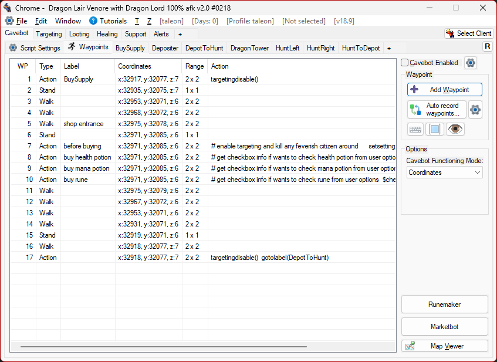

# OldBot - Tibia Automation Bot

## The Story

I started OldBot in 2017 as a side project while learning AutoHotkey. What began as "can I make my character walk automatically?" turned into an 8-year journey of reverse engineering, pixel manipulation, memory reading, and countless hours debugging edge cases at 3 AM.

This project taught me more about programming than any course ever could:
- How to read game memory without documentation
- How to make unreliable pixel detection... reliable
- How to build complex GUIs in a scripting language never meant for it
- How to support users across hundreds of different private servers, each with their own quirks

For years, OldBot was my creative outlet, my side income, and honestly, a big part of my identity as a developer.

## A Word About the Code

**I learned to program by writing this bot.**

No AI ever touched this code, it was written before AI for coding a thing. Everything in here was written by me, or copied from some random Stack Overflow or AutoHotkey forum post.

That means somewhere in these 50,000+ lines, you'll find:
- Variable names that made sense at 2 AM (they don't anymore)
- Copy-pasted blocks that should have been functions
- Comments in Portuguese, English, and occasionally despair
- "Temporary" fixes from 2018 that are still running
- At least 3 different ways of doing the same thing, each written as I learned a better way
- In general, probably some of the worst AutoHotkey code you've ever seen in your life, and may be somewhere, some of the best as well

**This is not clean code. This is survival code.**

If you're learning, treat this as a museum of "how things evolved" rather than "how things should be done." The early files are... humbling. The later files are better. That's growth.

If you're an experienced dev, please be kind. We all started somewhere, and my "somewhere" is immortalized in this repo forever.

## Why Open Source Now?

Life moves on. My career grew, priorities shifted, and the time I once had for maintaining OldBot and supporting all the users on Discord, became time I needed elsewhere. 

Rather than let the code rot on a private repo, I wanted to give it a proper farewell, open to the world, for anyone who wants to learn from it, fork it, or just see how a complex(and messy) AHK project comes together.

**It's time, eight years was a good run.**

## Important Notice

**This project is not actively maintained, but pull requests are welcome.**

- No support will be provided
- Pull requests for bug fixes and improvements are welcome

The code has been modified to work without authentication, you can use it freely and it still works on all the servers up to the day this repo was created (2026-01-31).
I may update it from time to time, nothing guaranteed, if I have the time or motivation.

**Use at your own risk.**

## How to Run

### Option A: Using the Installer (Recommended)

1. Download `OldBot_Installer.exe` from the [Releases page](https://github.com/alfredomtx/oldbot/releases/tag/v18.9)
2. Run the installer and follow the prompts
3. Launch OldBot from the installed location
4. Select your Tibia client window

### Option B: Running from Source (For Developers)

1. Clone or download this repository
2. Install AutoHotkey v1.1 using `Data/AutoHotkey_1.1.32.00_setup.exe` (included in the repo)
3. **Run `Setup.ahk` once** (configures paths for your system)
4. Run `OldBot Pro.ahk`
5. Select your Tibia client window

##  What's Inside (For Learners)

If you're here to learn or you're just curious, you're in the right place. This codebase contains:

| Technique | Description |
|-----------|-------------|
| Memory Reading | Reading game client memory for coordinates |
| Pixel/Image Detection | Fast, reliable screen automation |
| Minimap Navigation | Converting pixel positions to game coordinates |
| Complex GUIs | 650+ files of AutoHotkey GUI code, and my own custom GUI framework |
| IPC (WM_COPYDATA) | Inter-process communication between scripts |
| Waypoint Systems | Pathfinding and navigation automation |
| Multi-threading | Parallel execution patterns in AHK v1 |

And a ton of other stuff that I might not even remember right now.

**Total: ~50,000+ lines of battle-tested AutoHotkey v1 code.**

## 🙏 Thank You

To everyone who used OldBot over the years, thank you. Your bug reports made it better. Your feature requests pushed me to learn more. Your support (literally) helped pay bills during tough times.

To the Tibia private server community, you kept a 25-year-old game alive, and I got to be a small part of that.

To AutoHotkey, for being the weird, wonderful language that made all this possible.

## License

MIT License - See [LICENSE](LICENSE) file.

---

*Built with mass amounts of coffee by Alfredo Menezes, 2017-2026*

*"It's not about the destination, it's about the mass amounts of coffee consumed along the way."*
